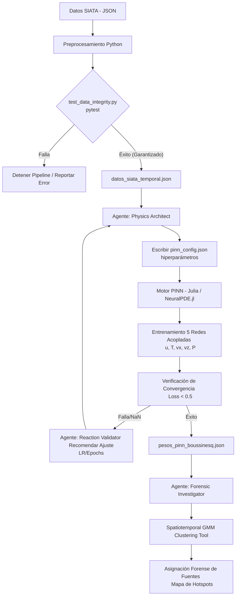

# Localización de Fuentes de PM10/PM2.5 con Adaptive Inverse PINNs y Agentes MLOps

Este repositorio contiene el código fuente para un proyecto de investigación enfocado en resolver el problema inverso de dispersión de material particulado (PM2.5 y PM10) en el **Valle de Aburrá, Colombia**, utilizando **Redes Neuronales Informadas por la Física (PINNs)** apoyadas por una arquitectura **Multi-Agente**.

## 📌 Contexto del Problema

El Valle de Aburrá presenta una topografía compleja (un cañón estrecho) y condiciones meteorológicas variables que dificultan la identificación precisa de los "hotspots" o fuentes de emisión de contaminación del aire. Al tratar de identificar estas fuentes utilizando exclusivamente los datos de los sensores, nos enfrentamos a un problema matemático "mal planteado" (*ill-posed*).

Para solucionar esto, integramos:
1. **Datos de Alta Densidad**: Red de "Ciudadanos Científicos" del SIATA.
2. **Restricción Física**: Ecuación de Advección-Difusión-Reacción (ADR).
3. **Optimización Agéntica**: Modelos de Lenguaje (LLMs) orquestando el entrenamiento y validando la termodinámica.

---

## 🏗️ Arquitectura y Estado del Proyecto (Curriculum Learning)

El proyecto se está desarrollando de forma iterativa y "hueso a hueso" para garantizar estabilidad matemática.

### ✅ Fase 1: Fundamentos Geoespaciales y Datos (Python)
**Estado:** `Completado`
- **Ingeniería de Datos**: Cliente automatizado para la Red de Ciudadanos Científicos de SIATA.
- **Filtrado de Ruido**: Algoritmo `IsolationForest` para detectar y descartar lecturas anómalas por descalibración de sensores *low-cost*.
- **Restricción de Dominio ($\Omega$)**: Bounding box topológico del Valle de Aburrá para evitar distorsión de la matriz Jacobiana con coordenadas irreales.
- **Preprocesamiento Adimensional**: Mapeo estricto del espacio a $[-1, 1]$ y tiempo a $[0, 1]$.

### ✅ Fase 2: Motor Físico PINN (Julia)
**Estado:** `Completado (Script Base)`
- **Framework**: `NeuralPDE.jl` y `ModelingToolkit.jl` por su alto rendimiento.
- **Acoplamiento Boussinesq (Termodinámica)**: Acorde a las dinámicas del Valle de Aburrá (documentadas en literatura de Spitsbergen/Inversión Térmica), la ecuación de advección simple fue reemplazada por un sistema de 5 ecuaciones en un corte transversal vertical ($x, z$).
- **Topografía como Restricción**: Se imponen *hard-constraints* en las laderas y fondo del valle (condiciones No-Slip).
- **Flotabilidad y Estratificación**: La velocidad vertical del viento ($v_z$) está directamente acoplada al gradiente de temperatura ($T$) mediante el término de flotabilidad $\beta g (T - T_{ref})$, modelando matemáticamente la inversión térmica y acumulación de partículas en la capa límite.
- **Redes Neuronales Múltiples**: 5 arquitecturas MLP separadas en `Lux.jl` para predecir $[u, T, v_x, v_z, P]$ evitando colapso de gradientes entre dominios físicos dispares.

### ✅ Fase 3: Arquitectura Agéntica (CrewAI)
**Estado:** `Completado (Esqueleto y Tools)`
Desarrollo de un ecosistema de agentes LLM orquestado por **Gemini 1.5 Pro**, diseñado para aislar el razonamiento del cómputo numérico puro:
- **Physics Architect:** Controla el ciclo de entrenamiento. Usa un *CLI-Bridge Tool* (`ExecuteJuliaPINNTool`) para lanzar `train_interpolative.jl` y ajusta los hiperparámetros (Adam/Epochs) según los logs de *Loss* en tiempo real.
- **Reaction Validator:** Verifica que los resultados no violen las leyes de la termodinámica.
- **Source Forensic Investigator:** Emplea algoritmos de agrupamiento como **Gaussian Mixture Models (GMM)** y **ST-DBSCAN** a través de `SpatiotemporalClusteringTool` para separar las nubes dinámicas de contaminación en el tiempo y el espacio, asignando probabilidades a las fuentes originarias.

## 🔄 Pipeline Completo de Integración (Visión a Futuro)

Para consolidar el desarrollo en una arquitectura verdaderamente autónoma e interconectada, se desarrollará el siguiente ciclo (Pipeline) de ejecución end-to-End, estructurado como se muestra a continuación:



1. **Adquisición Dinámica (Agente + Sensor)**:
   - Python inicia el ciclo. El agente extrae los datos geográficos de SIATA o usa el dataset temporal (generado por `scratch_siata.py`).
2. **Inyección en Julia (CLI-Bridge)**:
   - El *Physics Architect Agent* escribe un archivo `pinn_config.json` con los hiperparámetros óptimos y lanza un subproceso de sistema llamando al motor `NeuralPDE` de Julia (`train_interpolative.jl`).
3. **Entrenamiento Físico (Curriculum Learning Autonómo)**:
   - Julia carga las 5 redes acopladas y empieza a optimizar. Mientras entrena, imprime su error a la salida estándar (`stdout`).
   - El Agente de Python está *escuchando* esta salida. Si detecta un colapso del gradiente (`NaN`) o un estancamiento en un mínimo local, detiene el proceso de Julia, razona lógicamente, y lo reinicia ajustando el *Learning Rate*.
4. **Fase Inversa y Extracción de Coordenadas**:
   - Una vez Julia consolida el campo de advección, se pasa a la resolución Inversa. Julia descubre la Función Fuente $S(x, z)$ y exporta las coordenadas de máxima emisión.
5. **Clustering y Atribución Final**:
   - El *Forensic Investigator Agent* aplica *Gaussian Mixture Models (GMM)* sobre las coordenadas descubiertas por Julia para modelarlas como nubes y cruzarlas con mapas estáticos (OpenStreetMap) atribuyendo, sin intervención humana, la culpa de la contaminación a corredores industriales o vías altamente congestionadas.

---

## 🧪 Aseguramiento de Calidad y Robustez Matemática (QA & Testing Framework)

> [!IMPORTANT]
> **¿Por qué son críticas estas pruebas en Scientific ML / PINNs?**
> A diferencia de la regresión clásica, una PINN entrena minimizando los residuos de ecuaciones diferenciales parciales espaciotemporales. Si el preprocesador de datos inyecta un solo `NaN`, un `inf`, o coordenadas fuera del dominio del Valle de Aburrá ($\Omega$), las derivadas parciales computadas por diferenciación automática en Julia colapsarán a `NaN`, deteniendo por completo el optimizador numérico.
>
> Nuestro suite de pruebas en `tests/test_data_integrity.py` cuenta con **39 aserciones** automatizadas que previenen fallos catastróficos en el motor de optimización:
>
> *   **Verificación del Dominio Geográfico Complejo:** Comprueba que los puntos evaluados estén dentro de la topología real del Valle de Aburrá (usando delimitación por Shapely), previniendo la distorsión del residuo en laderas y bordes.
> *   **Monotonía y Linealidad del Escalamiento:** Asegura que el mapeo espacial y temporal a los dominios adimensionales $[-1, 1]$ (espacio) y $[0, 1]$ (tiempo) sea lineal y monótonamente creciente. Si esto fallara, el cálculo físico de gradientes espaciales ($\frac{\partial u}{\partial x}$) representaría una física deformada.
> *   **Tratamiento de Ruido Extremo de Sensores:** Filtra valores negativos de concentración (ruido común en sensores de bajo costo) forzándolos a $0.0$ físico para no violar la conservación de masa, y satura lecturas fuera de rango o infinitas de forma segura a $1.0$.
> *   **Robustez de Ingesta:** Valida el comportamiento estable del pipeline ante dataframes vacíos o con datos faltantes (`NaN`).

---

## ⚙️ Instalación y Uso

El proyecto opera bajo un ecosistema dual (Python para orquestación de datos/agentes, y Julia para cálculo de ecuaciones diferenciales).

### 1. Entorno de Python (Datos y Agentes)
```bash
python -m venv .venv
source .venv/bin/activate  # En Linux/Mac
.venv\Scripts\activate     # En Windows (Cmd)
```

> **Nota para usuarios de Windows (PowerShell):**
> Si recibe el error `UnauthorizedAccess` o "la ejecución de scripts está deshabilitada", ejecute el siguiente comando una sola vez como Administrador o para su usuario:
> ```powershell
> Set-ExecutionPolicy Unrestricted -Scope CurrentUser
> ```
> Y vuelva a intentar activar el entorno.

```bash
pip install -r requirements.txt
```

> [!TIP]
> **Solución de Problemas (Troubleshooting) en Windows:**
> * **Error de SSL (`SSLError`) al descargar datos de SIATA en entornos Conda:**
>   Si tu entorno de Conda no localiza las librerías OpenSSL (`libssl.dll` / `libcrypto.dll`), corre tus comandos anteponiendo el ejecutable de Conda. Esto forzará la carga de las variables dinámicas de entorno necesarias:
>   ```powershell
>   & D:\Usuarios\Cristian\miniconda3\Scripts\conda.exe run -p D:\Usuarios\Cristian\miniconda3 .venv\Scripts\python.exe -m pytest tests/test_data_integrity.py
>   ```
> * **Errores de Compilación en dependencias (C++ Build Tools):**
>   Librerías como `greenlet>=3` pueden fallar en Windows si no tienes Microsoft Visual C++ Build Tools instalado. El archivo `requirements.txt` está configurado para forzar `greenlet<3`, lo que instala una versión precompilada (`wheel`) y evita la compilación desde código fuente.

### 2. Entorno de Julia (PINN)
Asegúrese de tener Julia `1.10+` instalado.
```bash
julia init_julia.jl
```
*Nota: La primera instalación descargará y compilará el stack científico de SciML (NeuralPDE, Optimization), lo que puede tomar entre 5 y 10 minutos.*

### 3. Pruebas y Validación
Para verificar la integridad matemática y espacial de los datos:
```bash
python -m pytest tests/test_data_integrity.py -v
python src/geo/map_generator.py # Generará un mapa interactivo (mapa_validacion.html)
```

Para probar el pre-acondicionamiento interpolativo de la red neuronal:
```bash
julia src/pinn/train_interpolative.jl
```

---
*Desarrollado como proyecto de Aprendizaje Automático.*
