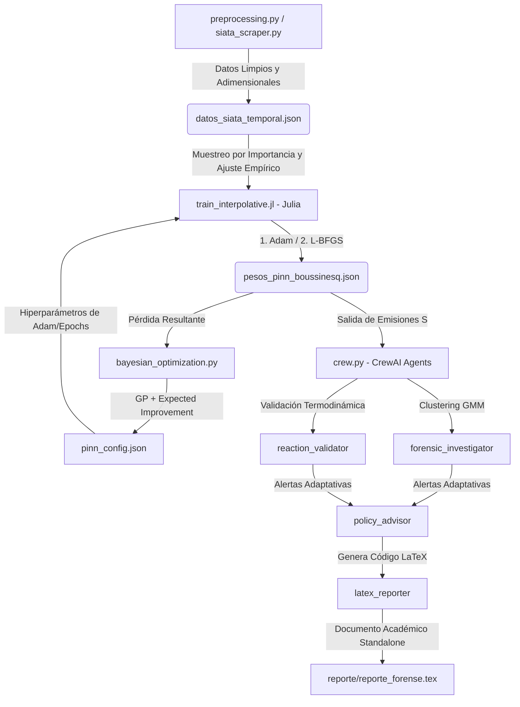

# Localización de Fuentes de PM10/PM2.5 con Adaptive Inverse PINNs y Agentes MLOps

Este repositorio contiene el código fuente para un proyecto de investigación enfocado en resolver el problema inverso de dispersión de material particulado (PM2.5 y PM10) en el **Valle de Aburrá, Colombia**, utilizando **Redes Neuronales Informadas por la Física (PINNs)** apoyadas por una arquitectura **Multi-Agente**.

## 📌 Contexto del Problema

El Valle de Aburrá presenta una topografía compleja (un cañón estrecho) y condiciones meteorológicas variables que dificultaron la identificación precisa de los "hotspots" o fuentes de emisión de contaminación del aire. Al tratar de identificar estas fuentes utilizando exclusivamente los datos de los sensores, nos enfrentamos a un problema matemático "mal planteado" (*ill-posed*).

Para solucionar esto, integramos:
1. **Datos de Alta Densidad**: Red de "Ciudadanos Científicos" del SIATA.
2. **Restricción Física**: Ecuación de Advección-Difusión-Reacción (ADR).
3. **Optimización Agéntica**: Modelos de Lenguaje (LLMs) orquestando el entrenamiento y validando la física.

## 🏗️ Arquitectura y Estado del Proyecto (Curriculum Learning)

El proyecto se está desarrollando de forma iterativa y "hueso a hueso" para garantizar estabilidad matemática y física. A continuación se detallan las características reales implementadas en la base de código actual:

### ✅ Fase 1: Fundamentos Geoespaciales y Datos (Python)
**Estado:** `Completado`
- **Ingeniería de Datos**: Cliente automatizado para la Red de Ciudadanos Científicos de SIATA (`siata_scraper.py`).
- **Filtrado de Ruido**: Algoritmo `IsolationForest` para detectar y descartar lecturas anómalas por descalibración de sensores *low-cost* (umbral de contaminación de $5\%$).
- **Restricción de Dominio ($\Omega$)**: Bounding box topológico del Valle de Aburrá (Lat $[6.00, 6.45]$, Lon $[-75.70, -75.30]$) para evitar distorsiones con coordenadas ficticias (`aburra_domain.py`).
- **Preprocesamiento Adimensional**: Mapeo estricto del espacio a $[-1, 1]$ y tiempo a $[0, 1]$ para mitigar gradientes numéricos patológicos (`preprocessing.py`).
- **Mapeador Visual**: Generador de mapas interactivos HTML (`mapa_validacion.html`) basado en `folium` para verificar los límites físicos (`map_generator.py`).

### ✅ Fase 2: Motor Físico PINN (Julia)
**Estado:** `Completado y Optimizado`
- **Framework**: `NeuralPDE.jl`, `ModelingToolkit.jl` y `Lux.jl` por su alto rendimiento científico.
- **Acoplamiento Boussinesq (Termodinámica)**: Simulación bidimensional transversal $(x, z)$ que acopla 5 ecuaciones diferenciales parciales: masa/continuidad, momentum X y Z (con flotabilidad térmica de Boussinesq $\beta g (T - T_{ref})$), transporte de calor y transporte de contaminantes ($u$) con tasa de emisión $S(x, z, t)$ y penalización Brinkman.
- **Topografía como Restricción**: Se aplica una máscara de relieve parabólica $z = 0.4x^2$ acoplada a una penalización Darcy-Brinkman masiva para forzar a que las velocidades y concentraciones sean cero en el subsuelo.
- **Muestreo de Importancia (`ImportanceSampler`)**: Algoritmo Quasi-Monte Carlo personalizado que sobremuestrea zonas cerca del suelo ($z \approx 0$) y en la inversión térmica ($z \approx 0.5$), proyectando automáticamente puntos subterráneos al área atmosférica activa (`AdvectionDiffusion.jl`).
- **Redes Neuronales Múltiples (Lux.jl)**: Se emplean **6 arquitecturas MLP independientes** con capas ocultas ampliadas a **64 neuronas** para modelar adecuadamente las 5 PDEs acopladas y el relieve, evitando la interferencia de gradientes. La sexta red (emisión $S$) cuenta con una función de activación final `softplus` para garantizar que la emisión de contaminantes sea físicamente positiva ($S \geq 0$).
- **Entrenamiento en Dos Etapas e Integridad Científica (`train_interpolative.jl`)**:
  - **Mitigación de Fuga de Datos (Spatial Data Leakage)**: División de datos basada en estaciones físicas completas (**80% entrenamiento / 20% validación**) para asegurar que la capacidad de generalización se evalúe sobre estaciones no vistas.
  - **Monitoreo de Pérdida de Validación**: Computación y registro de la pérdida de validación en tiempo real en los logs (`Val Loss`) durante cada época de las dos fases de optimización:
    1.  **Fase 1 (Global)**: Optimización inicial rápida con `Adam` usando hiperparámetros inyectados por JSON.
    2.  **Fase 2 (Refinamiento)**: Optimización de precisión milimétrica mediante el resolvedor de segundo orden `L-BFGS`.

### ✅ Fase 3: Arquitectura Agéntica y MLOps (Python - CrewAI)
**Estado:** `Completado y Operativo`
Desarrollo de un ecosistema de agentes LLM orquestado por **Gemini 3.5 Flash**, diseñado para aislar el razonamiento del cálculo numérico puro. Se cuenta con **4 agentes activos** (`crew.py`):
- **Thermodynamics Validator (`reaction_validator`)**: Analiza la estabilidad de la inversión térmica (gradiente vertical de temperatura) y la atenuación de vientos en las laderas parabólicas.
- **Source Forensic Investigator (`forensic_investigator`)**: Aplica Gaussian Mixture Models (GMM) mediante la herramienta `SpatiotemporalClusteringTool` y cruza coordenadas con el Valle de Aburrá usando la herramienta `GeospatialValleQueryTool`.
- **Environmental Policy Advisor (`policy_advisor`)**: Formula planes dinámicos de alertas tempranas, restricciones vehiculares focalizadas y mitigación adaptativa de emergencias en el cañón.
- **LaTeX Forensic Reporter (`latex_reporter`)**: Compila las conclusiones del dictamen en un documento standalone académico `reporte/reporte_forense.tex` mediante la herramienta `WriteLatexForensicReportTool`.

#### 🤖 Optimización Bayesiana Activa (`bayesian_optimization.py`)
Módulo independiente que calibra de forma automatizada los hiperparámetros de la PINN (Learning Rate y épocas de Adam) ejecutando dinámicamente el motor de Julia. Utiliza un regresor de **Procesos Gaussianos (GP)** con kernel Matérn ($2.5$) y la función de adquisición de **Mejora Esperada (Expected Improvement - EI)** para minimizar la pérdida de manera robusta, escribiendo los resultados en `pinn_config.json`.

#### 🛡️ Monitoreo MLOps en Tiempo Real y Resiliencia (Meta-Learning)
Se ha integrado un sistema de telemetría y resiliencia en la ejecución de la PINN:
- **Monitoreo en Tiempo Real**: Python captura la salida estándar (`stdout`) de Julia en tiempo real mediante tuberías (`subprocess.Popen`). Esto permite rastrear de forma interactiva el progreso de las pérdidas durante las fases de Adam y L-BFGS (`[EPOCH_LOG]`).
- **Control de Divergencias y Estancamiento**: Si la pérdida colapsa a valores no numéricos (`NaN`) o se estanca en una meseta inerte (cambio < $10^{-5}$ durante 15 épocas), el controlador de Python aborta la simulación de inmediato para liberar recursos de cómputo.
- **Memoria Meta-Learning (`mlops_memory.json`)**: Registra el historial de ejecuciones con sus respectivas tasas de aprendizaje (LR), épocas y estados (éxito/fracaso). Si un LR causa una divergencia, el sistema realiza un **ajuste preventivo**, reduciendo a la mitad el LR en intentos posteriores. Soporta hasta 3 reintentos de decaimiento automático.
- **Visualización de Pérdida**: Genera de forma automática una gráfica estilizada lineal (`reporte/curva_perdida.png`) que muestra la progresión de la convergencia de la pérdida a lo largo de las épocas de entrenamiento, sirviendo como diagnóstico visual para los auditores.

---

## 📊 Propuestas de Métricas para la Evaluación de Pérdida del Entrenamiento

Para enriquecer la evaluación del entrenamiento y evitar falsos positivos de convergencia en este sistema acoplado no lineal, se proponen e implementan conceptualmente las siguientes métricas diagnósticas:

### 1. Desglose Multicomponente de la Pérdida (Loss Dissection)
Dado que la pérdida agregada puede ocultar comportamientos anómalos de alguna variable, se propone monitorear y graficar por separado:
*   **Residuo Físico de la PDE ($L_{PDE}$)**: Sumatoria de los residuos cuadráticos de las 5 ecuaciones diferenciales parciales dentro de la atmósfera activa.
*   **Pérdida de Condiciones de Frontera ($L_{BC}$)**: Precisión del ajuste en laderas (condición no-slip) y perfil de inversión térmica basal.
*   **Pérdida Empírica de Datos ($L_{Data}$)**: El error absoluto o cuadrático respecto a los sensores de SIATA (`additional_loss`). Se calcula usando el **NRMSE** (Normalized Root Mean Squared Error) para independizar la escala de las variables adimensionales.

### 2. Índice de Violación Física (Physics Violation Index - PVI)
Métricas calculadas en una cuadrícula densa uniforme de evaluación al final de cada ciclo:
*   **Volumen de Divergencia de Vientos**: $\int_{\Omega} \left| \frac{\partial v_x}{\partial x} + \frac{\partial v_z}{\partial z} \right| d\Omega$. Evalúa la incompresibilidad del flujo. Valores mayores a $0.05$ denotan fallos de masa de aire.
*   **Tasa de Negatividad Volumétrica (NVR)**: Porcentaje del espacio en el cual la variable de concentración $u(x,z,t) < 0$, lo cual viola el principio de conservación de masa de la materia.

### 3. Índice de Estratificación Térmica (TSI)
Mide la consistencia termodinámica de la inversión térmica en la capa límite:
*   **TSI** = $\frac{\partial T}{\partial z}$.
*   Verifica que en la región de inversión térmica ($z \approx 0.5$), el TSI sea positivo ($\text{TSI} > 0$), y que el viento vertical $v_z$ se atenúe exponencialmente al aproximarse a esta barrera térmica, validando el fenómeno de confinamiento.

### 4. Rigidez de Gradiente del Acoplamiento ($\lambda_{stiff}$)
Monitorea la competencia numérica entre la física y los datos reales:
$$\lambda_{stiff} = \frac{\|\nabla_{\theta} L_{PDE}\|_2}{\|\nabla_{\theta} L_{Data}\|_2}$$
*   Si $\lambda_{stiff} \gg 1$, la física impone restricciones rígidas impidiendo que la red se ajuste a los sensores reales.
*   Si $\lambda_{stiff} \ll 1$, la red ignora el modelo matemático y realiza una interpolación puramente de datos. El valor óptimo se calibra dinámicamente mediante el optimizador bayesiano.

---

## 🔄 Pipeline Completo de Integración

El ciclo de ejecución autónomo y conectado opera de la siguiente manera:



---

## ⚙️ Instalación y Uso

El proyecto opera bajo un ecosistema dual (Python para orquestación de datos/agentes, y Julia para cálculo de ecuaciones diferenciales).

### 1. Entorno de Python (Datos y Agentes)
```bash
python -m venv .venv
source .venv/bin/activate  # En Linux/Mac
.venv\Scripts\activate     # En Windows (Cmd)
```

> **Nota para usuarios de Windows (PowerShell):**
> Si recibe el error `UnauthorizedAccess` o "la ejecución de scripts está deshabilitada", ejecute el siguiente comando una sola vez como Administrador o para su usuario:
> ```powershell
> Set-ExecutionPolicy Unrestricted -Scope CurrentUser
> ```
> Y vuelva a intentar activar el entorno.

```bash
pip install -r requirements.txt
```

### 2. Entorno de Julia (PINN)
Asegúrese de tener Julia `1.10+` instalado.
```bash
julia init_julia.jl
```
*Nota: La primera instalación descargará y compilará el stack científico de SciML (NeuralPDE, Optimization), lo que puede tomar entre 5 y 10 minutos.*

### 3. Pruebas y Validación
Para verificar la integridad matemática y espacial de los datos:
```bash
python -m pytest tests/test_data_integrity.py -v
python src/geo/map_generator.py # Generará un mapa interactivo (mapa_validacion.html)
```

Para probar el pre-acondicionamiento interpolativo de la red neuronal:
```bash
julia src/pinn/train_interpolative.jl
```

---
*Desarrollado como proyecto de Aprendizaje Automático.*
